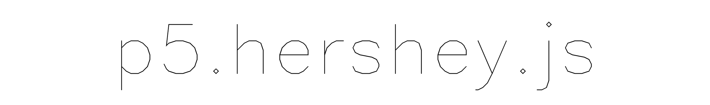

p5.js Hershey Vector Font Library. ([Live Demo](https://lingdong-.github.io/p5-hershey-js/))

> The Hershey fonts are a collection of vector fonts developed c. 1967 by Dr. Allen Vincent Hershey at the Naval Weapons Laboratory, originally designed to be rendered using vectors on early cathode ray tube displays. The fonts are publicly available and have few usage restrictions. Vector fonts are easily scaled and rotated in two or three dimensions; consequently the Hershey fonts have been widely used in computer graphics, computer-aided design programs, and more recently also in computer-aided manufacturing applications like laser engraving. ([Wikipedia](https://en.wikipedia.org/wiki/Hershey_fonts))

This [p5.js](http://p5js.org) library renders the Hershey fonts in the browser. It can parse user-provided Hershey fonts along with custom character mapping.

### Supported Character Sets

Roman | Gothic | Greek | Other
--- | --- | --- | ---
`COMPLEX` | `GOTHIC_ENGLISH_TRIPLEX` | `GREEK_COMPLEX` | `ITALIC_COMPLEX`
`COMPLEX_SMALL` | `GOTHIC_GERMAN_TRIPLEX` | `GREEK_COMPLEX_SMALL` | `ITALIC_COMPLEX_SMALL`
`DUPLEX` | `GOTHIC_ITALIAN_TRIPLEX` | `GREEK_PLAIN` | `ITALIC_TRIPLEX`
`PLAIN` | | `GREEK_SIMPLEX` | `SCRIPT_COMPLEX`
`SIMPLEX` | | | `SCRIPT_SIMPLEX`
`TRIPLEX` | | | `CYRILLIC_COMPLEX`

## Usage

### Minimal Example

In HTML, include the library as well as the data file.

```html
<script src="p5.hershey.js"></script>  
<script src="p5.hershey.data.js"></script>  
```

And in the p5 sketch javascript, call `P5.hershey.putText`

```javascript
push();
translate(100,100);
noFill();
stroke(0);
strokeWeight(1);
P5.hershey.putText("Hello World!");
pop();

```

### Advanced

```javascript
P5.hershey.putText("Hello World!",{
	cmap:  HERSHEY_FONT.GOTHIC_GERMAN_TRIPLEX,
	noise: 0.5,
});
```

- `cmap` specifies the character mapping to use, see **Supported Character Sets** for details.
- `noise` can be used to add special effects to the vertices. `noise` can be either of the following datatypes:
	- if `noise` is a number, a default `randomGaussian` filter is applied to give a jiggly/nervous effect using `noise` as the standard deviation.
	- if `noise` is an object of the form `{x: (x,y)=>(x_offset), y: (x,y)=>(y_offset)}`, `noise.x` and `noise.y` will be called on each vertex, and the return value is used as the offset for the respective axis.

### Custom Fonts

Users can also provide their own Hershey fonts and mappings. To parse a correctly formatted Hershey font as a string, use:

```javascript
var font_data = P5.hershey.parseFontString("   49 12LXRMRV RNOOPOSQTSTUSUPVO");
```

A mapping from unicode entry point to the index used by the hershey font is also required. If the indices are identical, this can be as simple as:

```javascript
var cmap = (x)=>(x);
```

Say you have a more complicated mapping, where characters `A`,`B`,`C`,`D` will be mapped to indices 2,4,6,8 in the Hershey font:

```javascript
var cmap = (x)=>([2,4,6,8][x-65]);
```

Finally feed the font and the mapping to `P5.hershey.putText`:

```javascript
P5.hershey.putText("Hello World!",{
	font:  font_data,
	cmap:  cmap,
});
```

## Examples

- [Live Demo](https://lingdong-.github.io/p5-hershey-js/), see `index.html` for details.
- [ttf2hershey](https://github.com/LingDong-/ttf2hershey), a tool for converting True Type Fonts to Hershey fonts.


## Preview


## References

- http://paulbourke.net/dataformats/hershey/